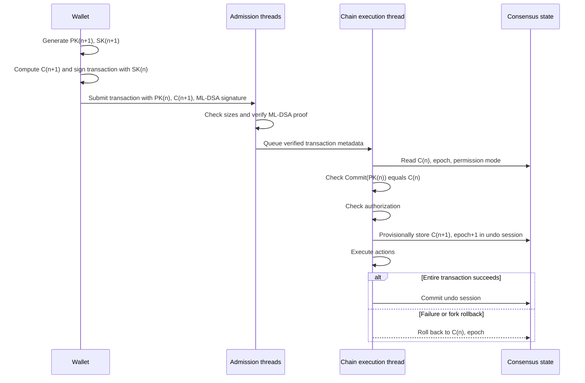
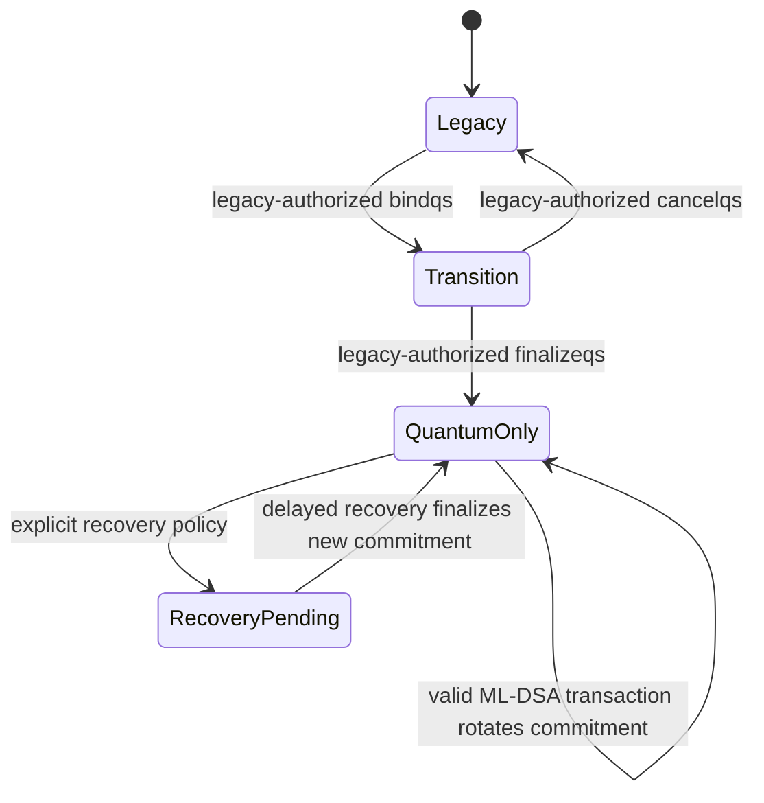

# Quantum-Safe Authorization V1 Detailed Design

| Item | Value |
| --- | --- |
| Status | Draft for review; no implementation is authorized by this document |
| Target branch | `quantum-safe-feature` |
| Algorithm | ML-DSA-65, FIPS 204 |
| Public key | Exactly 1952 bytes |
| Signature | Exactly 3309 bytes |
| Commitment hash | SHA-256 with domain separation and canonical encoding |
| Compatibility | Legacy and quantum-safe transactions coexist after protocol activation |

## 1. Executive summary

Quantum-Safe Authorization V1 (QSA-V1) adds a key-evolving authorization mode for a specific
`account@permission`. The consensus state does not store the full ML-DSA public key. Instead, it stores a
32-byte commitment to the public key that is authorized to sign the next transaction.

QSA-V1 follows a one-time-key policy: one ML-DSA key pair belongs to exactly one authorization epoch and may
complete at most one successful canonical-chain authorization. A successful transaction consumes the current
key by replacing its commitment, so the same key cannot authorize a second successful transaction.

For authorization epoch `n`:

1. State contains commitment `C_n` to public key `PK_n`.
2. The client creates the following epoch's key pair `(SK_(n+1), PK_(n+1))` and commitment `C_(n+1)`.
3. The transaction carries `PK_n`, `C_(n+1)`, and an ML-DSA-65 signature made by `SK_n`.
4. Every validating node checks `Commit(PK_n) == C_n`, verifies the signature, executes the transaction, and
   atomically replaces `C_n` with `C_(n+1)`.

This means `PK_(n+1)` is not placed in transaction `n` and is not disclosed when `C_(n+1)` is recorded. It is
revealed only in transaction `n+1`, when it becomes the current one-time verification key. It does **not** make
`PK_n` private after use: a public key included in a transaction is part of block history and can be retained
permanently by nodes, indexers, and observers. The precise claim is therefore:

> Full public keys are not stored in persistent permission state. The next public key remains hidden behind a
> commitment until its first use. A public key revealed in a transaction is public blockchain data.

### 1.1 One-time-key invariant

- Consensus state authorizes exactly one `(epoch, commitment)` for each quantum-safe `account@permission`.
- Transaction `n` reveals only `PK_n`; it never contains `PK_(n+1)`.
- Transaction `n` records `C_(n+1)`, bound to the same account and permission, as the sole next authorization.
- Once transaction `n` is irreversible, the wallet securely erases `SK_n`.
- A stale epoch, public key, or commitment is rejected before action execution.
- A wallet must not create parallel distinct transactions for the same epoch.

The consensus guarantee is **at most one successful authorization per key pair**. Retransmitting the same packed
transaction is not a second use. Because a transaction can expire or disappear on a fork, the wallet must retain
the key until irreversibility; the exceptional retry boundary is specified in Section 13.

## 2. Required corrections to the initial proposal

The initial concept is preserved, with the following security-critical refinements.

### 2.1 Bind commitments to a permission, not only an account

FullOn permissions are identified by `account@permission`, and an account may have `owner`, `active`, custom
permissions, delegated accounts, weights, and delays. A single account-level hash cannot identify which
permission is being satisfied. QSA-V1 therefore keys all state by `permission_level`.

### 2.2 First binding must not skip authorization

Accepting an arbitrary ML-DSA public key when no commitment exists would allow anyone to claim an unmigrated
account. The first commitment must be installed by a transaction that satisfies the permission's existing legacy
authority. There is no unauthenticated bootstrap path.

### 2.3 Use a canonical, domain-separated commitment

Text concatenation such as `sha256(account + public_key)` is ambiguous and permits cross-protocol or cross-chain
reuse. The normative commitment includes fixed-width fields, the chain ID, permission, algorithm, and epoch.

### 2.4 Quantum-only permissions cannot silently fall back to legacy keys

Supporting legacy transactions at the chain level does not mean a migrated permission may accept both schemes
forever. Once a permission enters `quantum_only`, legacy authorization for that exact permission is rejected.
An optional transition mode may exist, but it must be labelled non-quantum-safe.

## 3. Goals and non-goals

### 3.1 Goals

- Add ML-DSA-65 transaction authorization without changing legacy transaction semantics.
- Store only a 32-byte public-key commitment in consensus permission state.
- Rotate to a freshly generated, previously undisclosed key commitment after every successful quantum-safe
  authorization, enforcing at most one successful authorization per key pair.
- Bind signatures to the chain, complete transaction, permission, epoch, and next commitment.
- Make fork rollback, replay, snapshots, state history, and transaction tracing deterministic.
- Bound CPU, memory, transaction count, and byte amplification caused by large ML-DSA material.
- Provide an explicit, legacy-authorized migration and recovery policy.

### 3.2 Non-goals for V1

- Quantum-safe producer block signatures or finalizer votes.
- Quantum-safe key exchange, encryption, or network transport.
- Threshold or aggregate ML-DSA.
- Hiding a public key after the transaction that reveals it is published.
- Automatically converting complex legacy authorities with multiple keys, accounts, or waits.
- Quantum authorization for delayed, deferred, generated, or implicit transactions in V1.
- Implementing code as part of this design phase.

## 4. Cryptographic profile

QSA-V1 uses ML-DSA-65 as specified by FIPS 204.

| Material | Normative size |
| --- | ---: |
| Public key | 1952 bytes |
| Private key expanded form | 4032 bytes |
| Signature | 3309 bytes |
| Commitment | 32 bytes |

Only the exact FIPS 204 encodings are accepted. Non-canonical encodings, wrong lengths, unknown algorithm IDs,
and trailing bytes are consensus errors.

The signing API signs the 32-byte FullOn quantum transaction digest as its message and uses the fixed context
string `FLON-QS-TX-v1`. Signature generation may use the FIPS 204 hedged mode when a trustworthy random source
is available; verification behavior is identical. The implementation must publish the exact library version,
known-answer tests, and FIPS 204 errata assessment before protocol activation.

### 4.1 Key-pair generation

Every quantum-safe one-time key pair, including the initially bound `(SK_0, PK_0)` and every successor
`(SK_(n+1), PK_(n+1))`, must be generated directly by the ML-DSA-65 key-generation algorithm defined by
FIPS 204. A legacy K1/R1 key must not be converted, reinterpreted, or used as an ML-DSA seed.

Key generation is performed locally by the wallet, hardware signer, or trusted signing service using a
cryptographically secure random source. It produces:

- an ML-DSA-65 public key `PK_n` encoded as exactly 1952 bytes; and
- the corresponding ML-DSA-65 private key `SK_n`, whose expanded encoding is exactly 4032 bytes when that
  representation is used.

The newly generated `PK_(n+1)` remains local while only its commitment `C_(n+1)` is submitted in transaction
`n`. Private keys are never transmitted to a node or written to chain state. Implementations must protect key
material at rest, avoid logging or swapping it where practical, and securely erase `SK_n` only after the
transaction that consumes epoch `n` becomes irreversible.

### 4.2 Algorithm identifier

```text
0x0001 = ML-DSA-65 / FIPS 204
```

All other values are reserved and rejected until activated by a later protocol feature.

## 5. Commitment construction

The conceptual formula remains `SHA-256(account, public_key)`, but the consensus formula is canonical:

```text
C_n = SHA256(
    utf8("FLON-QS-COMMIT-v1")             // 17 bytes, no terminator
 || chain_id                              // 32 bytes
 || account_name.value                    // uint64, big-endian
 || permission_name.value                 // uint64, big-endian
 || algorithm_id                          // uint16, big-endian
 || epoch                                 // uint64, big-endian
 || public_key_length                     // uint16, big-endian; must be 1952
 || public_key                            // exactly 1952 bytes
)
```

The stored `epoch` and committed `epoch` must agree. Including the epoch prevents a previously used public key
commitment from being reintroduced at a different position without an explicit recovery operation. Including
`chain_id` prevents the same commitment from being copied to another FullOn chain.

SHA-256 provides approximately 128 bits of generic preimage security against an ideal quantum adversary under
Grover's algorithm. This is the intended V1 security level. Algorithm agility is retained so a later protocol
feature can introduce a different commitment hash without reinterpreting V1 bytes.

## 6. Consensus state model

QSA-V1 should use a dedicated consensus object rather than adding an account-wide field to `account_object`.
This avoids ambiguity between permissions and reduces migration risk to existing account storage.

Logical schema:

```text
quantum_permission_object {
    id
    account_name       owner
    permission_name    permission
    uint16             algorithm_id       // 0x0001
    uint8              mode               // transition or quantum_only
    uint64             epoch
    checksum256        current_commitment
    block_timestamp    last_rotated_at
}
```

Required unique index:

```text
(owner, permission)
```

The referenced legacy `permission_object` must exist. Deleting a permission deletes its quantum object in the
same undo session. Renaming is not supported by the current permission model.

### 6.1 Permission modes

| State | Legacy transaction | Quantum transaction | Security meaning |
| --- | --- | --- | --- |
| No quantum object | Accepted normally | Rejected | Legacy |
| `transition` | Accepted | Accepted | Migration only; not quantum-safe |
| `quantum_only` | Rejected for this exact permission | Required | Quantum-safe authorization |

V1 migration to `quantum_only` is limited to a direct 1-of-1 permission: threshold 1, exactly one legacy key,
and no delegated accounts or waits. Complex authorities remain legacy until a later threshold design is
standardized. This prevents migration from silently changing existing authority semantics.

Parent permissions retain their hierarchy only through their own authorization mode. A legacy parent must not
silently satisfy a `quantum_only` child, because that would reintroduce a legacy bypass. Recovery policy is
described separately below.

## 7. Transaction formats and compatibility

The chain supports two logical transaction forms after activation.

### 7.1 Legacy signed transaction

The current `transaction`, `signed_transaction`, signature digest, K1/R1/WA recovery, authority checking, block
packing, and APIs remain byte-for-byte unchanged. Transactions without the QSA-V1 extension follow only the
legacy path.

### 7.2 Quantum-safe signed transaction V1

To minimize consensus-format disruption, QSA-V1 is represented by:

1. A unique, protocol-gated transaction extension containing quantum authorization claims.
2. ML-DSA signature entries in the packed transaction's signature area.

Logical structures:

```text
quantum_authorization_claim_v1 {
    permission_level permission
    uint16           algorithm_id          // ML-DSA-65
    uint64           epoch
    checksum256      previous_commitment
    checksum256      next_commitment
}

quantum_authorization_extension_v1 {
    vector<quantum_authorization_claim_v1> claims
}

quantum_signature_v1 {
    uint16           claim_index
    bytes[1952]      current_public_key
    bytes[3309]      signature
}
```

Claims are sorted strictly by `(account, permission)` and duplicates are rejected. Signature entries are sorted
by `claim_index`, contain exactly one entry per claim, and cannot refer outside the claim vector.

The current public key is outside persistent permission state but is still serialized in the packed transaction
and block history. The `next_commitment` is inside the transaction extension, so the current signature commits to
the state transition without circularly signing its own signature bytes.

### 7.3 Mixed authorization

A transaction may contain legacy signatures for unmigrated permissions and quantum signatures for migrated
permissions. Every declared action authorization must be satisfied exactly once by the appropriate mode. Unused
legacy signatures, unused quantum claims, duplicate claims, and claims for permissions not declared by an action
are rejected.

## 8. Signature digest

For claim `i`, construct:

```text
legacy_content_digest = SHA256(
    raw_pack(chain_id)
 || raw_pack(transaction)                  // includes all QSA-V1 claims
 || context_free_data_hash
)

quantum_signature_digest_i = SHA256(
    utf8("FLON-QS-SIG-v1")
 || legacy_content_digest                  // 32 bytes
 || raw_pack(claim_i.permission)
 || uint16_be(claim_i.algorithm_id)
 || uint64_be(claim_i.epoch)
 || claim_i.previous_commitment
 || claim_i.next_commitment
)
```

ML-DSA-65 signs `quantum_signature_digest_i` with context `FLON-QS-TX-v1`.

This binds the proof to:

- the FullOn chain ID;
- TAPOS reference and expiration;
- all actions and authorizations;
- all transaction extensions;
- context-free-data hash;
- the exact permission and epoch;
- both the expected current state and next state.

## 9. Client-side transaction construction

For every quantum authorization `account@permission` at epoch `n`:

1. Read a finalized or otherwise trusted state response containing `(algorithm_id, epoch, C_n)`.
2. Load `(SK_n, PK_n)` and verify locally that `Commit(PK_n, epoch=n) == C_n`.
3. Run the FIPS 204 ML-DSA-65 key-generation algorithm with a cryptographically secure random source to produce
   `(SK_(n+1), PK_(n+1))`; do not derive it by converting a legacy K1/R1 key.
4. Compute `C_(n+1) = Commit(PK_(n+1), epoch=n+1)`.
5. Build the transaction and claim containing `C_n`, `C_(n+1)`, and epoch `n`.
6. Compute the quantum signature digest and sign it with `SK_n` using ML-DSA-65.
7. Submit the packed transaction.
8. Mark that exact packed transaction as pending. Do not sign a different simultaneously admissible transaction
   with `SK_n`; byte-identical retransmission is allowed.
9. Retain both `SK_n` and `SK_(n+1)` until the transaction is irreversible.
10. After irreversibility, securely erase `SK_n` and promote `(SK_(n+1), PK_(n+1))` to current.

Wallets must serialize submissions per `account@permission`. Two concurrent transactions using the same epoch
are conflicts; at most one can become valid.

## 10. Node validation and execution

Nodes use the following deterministic order:

1. Decode the packed transaction with strict byte and count limits.
2. Reject QSA-V1 material unless the protocol feature is active.
3. Validate extension ordering, claim ordering, exact sizes, algorithm IDs, and claim/signature cardinality.
4. Apply TAPOS, expiration, duplicate transaction, blacklist, and subjective admission checks.
5. Recover and verify legacy signatures on the bounded chain thread pool.
6. For each quantum claim, load the matching `quantum_permission_object`.
7. Require `mode` to allow quantum authorization.
8. Compare account, permission, algorithm, epoch, and `previous_commitment` with state.
9. Recompute the commitment from the supplied 1952-byte public key and compare it in constant time.
10. Verify the 3309-byte ML-DSA-65 signature over the claim digest.
11. Run ordinary action authorization, treating successfully verified claims only as satisfaction for their exact
    declared permissions.
12. Provisionally update every claim to `(epoch+1, next_commitment)` inside the transaction's database undo
    session, before executing actions.
13. Execute all actions. An action that legitimately deletes the permission also deletes its quantum object; it
    must not be recreated after action execution.
14. Commit the provisional rotations if and only if the entire transaction succeeds.
15. On failure, fork switch, abort, or replay exception, roll back all commitment changes with the rest of the
    transaction state.



## 11. State machine



The normal quantum transaction path never creates the initial object and never changes its mode. Mode changes are
explicit system operations with separate audit events.

## 12. Migration and recovery

### 12.1 Initial binding

Introduce a system operation conceptually named `bindqs`:

```text
bindqs {
    permission_level permission
    uint16           algorithm_id
    uint64           initial_epoch       // must be 0
    checksum256      initial_commitment  // commitment to PK_0
    uint8            initial_mode        // transition or quantum_only
}
```

The transaction containing `bindqs` must satisfy the current legacy authority of the exact permission. The full
`PK_0` is generated and retained locally; it is not required in the binding transaction.

### 12.2 Finalizing migration

If transition mode is used, a separate `finalizeqs` operation changes it to `quantum_only`. It requires both:

- a valid quantum proof for the currently committed key; and
- the existing legacy authority.

This demonstrates possession of both sides before removing the legacy path.

### 12.3 Recovery

A permanent legacy fallback defeats the quantum-only security claim. Recovery must therefore be an explicit
governance choice. The recommended V1 policy is a delayed recovery commitment configured before migration:

- recovery is initiated by a separately designated permission;
- the new commitment is announced with a protocol-defined delay;
- the current quantum key may cancel during the delay;
- finalization emits an explicit trace and increments the epoch;
- no immediate legacy signature bypass exists.

Whether the recovery permission must itself be quantum-safe and the minimum delay are open governance decisions.

## 13. Forks, retries, concurrency, and key retention

- Commitment updates are normal chainbase writes and participate in block undo sessions.
- A transaction on a fork may reveal `PK_n` without rotating canonical state. The wallet must retain `SK_n` until
  irreversibility and may retransmit the same packed transaction when it is still admissible.
- A transaction expiring before inclusion leaves state at `C_n`. A literal ban on every second signature would
  permanently lock the permission. The wallet may therefore sign a replacement only after the prior transaction
  can no longer be accepted on any viable fork. The replacement must keep the same `C_(n+1)`, is treated as an
  exceptional recovery attempt, and must rotate the exposed key on its earliest successful inclusion.
- Only one in-flight epoch per permission is supported. Wallets must not create parallel dependency branches.
- The node rejects stale epochs and commitment mismatches before contract execution.
- Multiple quantum permissions in one transaction rotate atomically; partial rotation is impossible.
- QSA-V1 rejects `delay_sec > 0` and rejects quantum claims on deferred, generated, or implicit transactions.
  Supporting those paths later requires a separate specification for whether rotation occurs at scheduling or
  execution time and how cancellation affects wallet key state.

## 14. Protocol activation and upgrade compatibility

QSA-V1 is a consensus feature and requires a protocol feature such as:

```text
QUANTUM_SAFE_AUTHORIZATION_V1
```

Before activation:

- QSA-V1 transaction extensions are rejected as unsupported;
- ML-DSA signature variants are rejected;
- legacy transactions and blocks are unchanged.

After activation:

- upgraded nodes accept both legacy and QSA-V1 transactions;
- permissions without a quantum object remain legacy;
- migrated permissions enforce their configured mode;
- legacy transaction IDs and signature digests remain unchanged.

Activation is a hard-fork boundary for block validation. All producers, finalizers, API nodes, state-history
consumers, wallets, and signing services must be upgraded before the first QSA-V1 transaction is accepted.

Recommended rollout:

1. Ship binaries with QSA-V1 disabled.
2. Validate snapshots, replay, APIs, wallet backup/restore, and cross-language test vectors.
3. Upgrade all consensus and API infrastructure.
4. Activate the protocol feature through the established governance process.
5. Allow opt-in `transition` migrations.
6. Allow `quantum_only` after an observation period.

## 15. Persistence, history, and API behavior

The new state object must be included in:

- chainbase indices and undo sessions;
- binary and JSON snapshots;
- integrity validation and replay tests;
- state-history deltas;
- Deep Mind or equivalent deterministic state logging;
- account/permission query APIs.

Account APIs should return commitment metadata but not imply that a public key is secret:

```json
{
  "permission": "alice@active",
  "mode": "quantum_only",
  "algorithm": "ML-DSA-65",
  "epoch": 42,
  "current_commitment": "...",
  "last_rotated_at": "..."
}
```

Transaction, block, trace, and history APIs necessarily expose the current public key and signature present in a
QSA-V1 transaction. APIs must apply response-size and request-rate limits because a single authorization adds more
than 5 KiB before actions and other transaction overhead.

## 16. Resource accounting and TPS impact

Approximate quantum authorization payload:

```text
1952 public key
+ 3309 signature
+ 2 claim commitments, permission, epoch, algorithm, and vector framing
---------------------------------------------------------------
> 5.3 KiB per quantum permission per transaction
```

At 4,000 transactions per second with one quantum permission each, public-key and signature bytes alone exceed
20 MiB/s before actions, receipts, P2P framing, and redundancy. QSA-V1 therefore cannot assume that current TPS is
preserved merely by parallelizing signature verification.

Required resource controls:

- exact per-transaction maximum quantum claim count;
- maximum quantum bytes per transaction and per block;
- per-peer and global in-progress quantum verification byte budgets;
- bounded verification task count and memory queue;
- deadline-aware ML-DSA verification on the chain worker pool;
- cache verified results by `(transaction_id, claim_index)` across P2P relay and block application;
- separate metrics for decode, commitment hashing, ML-DSA verification, authorization, execution, and state write;
- net usage billing for every public-key and signature byte;
- CPU billing based on measured ML-DSA verification cost with a conservative multiplier.

The main execution thread should receive already verified immutable metadata, but it must repeat or trust only
consensus-safe cached verification tied to the exact packed transaction digest. Benchmark gates must include
simple transfers, multi-action transactions, mixed legacy/quantum authorization, block replay, and adversarial
invalid signatures.

## 17. Denial-of-service defenses

Validation must reject cheaply before performing ML-DSA verification:

1. packed transaction and decompression limits;
2. extension count, order, and unique ID;
3. exact key/signature sizes;
4. maximum claim count;
5. known algorithm ID;
6. permission existence and mode;
7. epoch and previous commitment equality;
8. commitment recomputation;
9. only then ML-DSA verification.

Invalid requests consume subjective peer/API budgets. Nodes should rate-limit repeated invalid commitment or
signature submissions without making rejection behavior consensus-dependent.

## 18. Security analysis

### 18.1 Threats addressed

- A future quantum attacker cannot use Shor's algorithm against ML-DSA-65 as it can against K1/R1.
- The next ML-DSA public key is hidden behind a preimage-resistant commitment until use.
- A successful authorization consumes its one-time key; a stolen old key cannot authorize after the epoch has
  rotated.
- Cross-chain, cross-permission, and cross-epoch commitment reuse is prevented by domain separation.
- Transaction replay is bounded by TAPOS, expiration, transaction ID, epoch, and previous commitment.

### 18.2 Residual risks

- A compromised current wallet can steal `SK_n` and `SK_(n+1)` before rotation.
- Public keys and signatures in accepted or gossiped transactions are observable.
- ML-DSA implementation bugs, side channels, RNG failures, or supply-chain compromise remain possible.
- SHA-256 has a quantum preimage security target of approximately 128 bits, not 256 bits.
- Legacy accounts and transition-mode permissions remain vulnerable to sufficiently capable quantum attackers.
- A legacy recovery path lowers the effective security of a quantum-only permission to that recovery path.
- Large signatures reduce block capacity and increase network, history, and API amplification risks.

## 19. Wallet and operational requirements

- Wallet storage must distinguish current, next, pending, superseded, and recoverable epochs.
- Backups must be atomic across key material and commitment metadata.
- The wallet must never discard `SK_n` based only on API acceptance or inclusion in a reversible block.
- The wallet must never sign two distinct, simultaneously admissible transactions with the same `SK_n`.
- Submission is single-flight per permission unless a future dependency-chain protocol is designed.
- Hardware-wallet and remote-signer protocols must stream or safely buffer 1952-byte keys and 3309-byte
  signatures.
- Signing services must display account, permission, epoch, actions, and next commitment for operator approval.
- `get_required_keys` requires a quantum-aware equivalent because ML-DSA public keys cannot be recovered from a
  signature.
- APIs should expose a preflight call that validates commitment/epoch without changing state.

## 20. Test and acceptance plan

### 20.1 Cryptographic tests

- FIPS 204 ML-DSA-65 known-answer tests.
- Exact public/private/signature length tests.
- Cross-language commitment and signature digest vectors.
- Malformed and non-canonical encoding corpus.
- Context and domain-separation mismatch tests.

### 20.2 Consensus tests

- Legacy transaction byte-for-byte regression before and after activation.
- Protocol feature rejection before activation.
- Initial binding requires legacy authority.
- Correct claim rotates state exactly once.
- A consumed key cannot authorize a second successful transaction.
- Wrong account, permission, chain ID, epoch, algorithm, commitment, key, signature, or next commitment fails.
- Mixed legacy/quantum multi-action transaction.
- Atomic rotation across multiple permissions.
- Duplicate and unused proof rejection.
- Fork switch, aborted block, replay, snapshot restore, and irreversible transition.
- Permission deletion and recovery-delay behavior.

### 20.3 Performance and abuse tests

- Verification throughput at 1, 2, 4, 8, and 16 worker threads.
- End-to-end TPS and block-size comparison against K1 transfers.
- Invalid commitment flood versus invalid signature flood.
- Maximum-size compressed and uncompressed transactions.
- P2P multi-peer and HTTP concurrency budget enforcement.
- History, trace, and RPC response amplification.

### 20.4 Acceptance gates

- No change to legacy transaction IDs, digests, replay results, or authorization behavior.
- All consensus implementations reproduce the published vectors.
- Fork rollback restores the exact prior commitment and epoch.
- Queue and byte budgets remain bounded during hostile load.
- Wallet recovery is demonstrated from backup at every key lifecycle state.
- Mainnet activation procedure and rollback boundary are approved before feature activation.

## 21. Open decisions requiring approval

1. Is V1 intentionally limited to direct 1-of-1 permissions?
2. Is `transition` mode required, and what is its maximum lifetime?
3. What recovery permission and delay are acceptable without weakening the quantum-only claim?
4. Should the commitment remain SHA-256 or use SHA3-256/SHAKE256 for a more uniform post-quantum profile?
5. What are the consensus maximum claim count and quantum bytes per transaction/block?
6. Which reviewed ML-DSA implementation and version will be normative for the first release?
7. Should signature generation require hedged mode, or merely recommend it?
8. Are producer and finalizer signatures explicitly out of scope for the first activation?
9. What API representation and string prefix identify ML-DSA keys and signatures?
10. Must a quantum-only parent be required before a child permission can enter quantum-only mode?

No implementation should start until these decisions are resolved and converted into consensus test vectors.

## 22. Future implementation work breakdown

This section records sequencing only; it does not authorize code changes.

1. Cryptographic provider abstraction and ML-DSA-65 test vectors.
2. Canonical commitment and quantum signature digest library.
3. Protocol feature, transaction extension, and signature variant.
4. Consensus state object, snapshots, undo, and state-history support.
5. Authorization integration and explicit migration/recovery system operations.
6. P2P/API admission budgets, verification pool, cache, and metrics.
7. Wallet key lifecycle, backup, signer APIs, and CLI support.
8. Replay, fork, mixed-mode, abuse, and performance test suites.
9. Staged testnet activation and security review.

## 23. References

- [NIST FIPS 204: Module-Lattice-Based Digital Signature Standard](https://doi.org/10.6028/NIST.FIPS.204)
- Existing transaction model: `libraries/chain/include/eosio/chain/transaction.hpp`
- Existing permission model: `libraries/chain/include/eosio/chain/permission_object.hpp`
- Existing authorization flow: `libraries/chain/authorization_manager.cpp`
- Existing protocol feature framework: `libraries/chain/include/eosio/chain/protocol_feature_manager.hpp`
